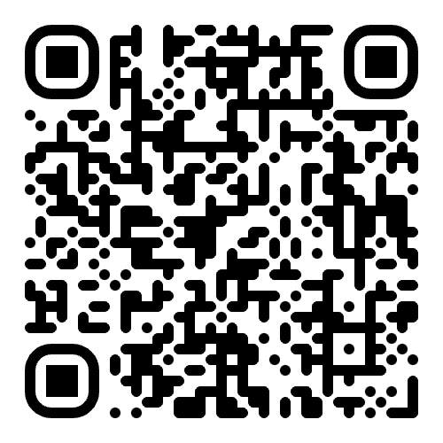

# 🕒 Digital Clock Web App

A simple and elegant **Digital Clock** built with HTML, CSS, and JavaScript.  
This responsive clock displays the current time in a clean, minimal interface — perfect for embedding in any webpage or using as a standalone dashboard.

---

> **Live Demo:** [Click to View](https://icanssungkar.github.io/TheClockOfMr.Frog/)

## ✨ Features

- ⏱ Real-time clock with AM/PM format
- 🎨 Clean, modern design with soft shadows and rounded corners
- 📱 Fully responsive — looks great on any device
- ⚡️ Lightweight and fast — no dependencies required

---

## 🧩 Technologies Used

- HTML5 for structure
- CSS3 for styling and layout
- JavaScript (vanilla) for live clock functionality

---

## 📸 QR Code

---

